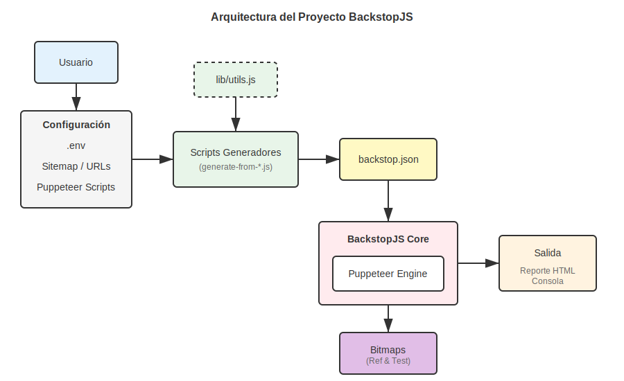

## 🎬 *Nota del autor*

*Este proyecto no nació en un garaje lleno de pizarrones ni en una noche interminable de café y código.*  
*Nació de una conversación con la inteligencia artificial. Y sí, eso incomodará a más de uno.*

*La intención nunca fue crear una obra “profesional”, ni sentar cátedra, ni competir en festivales de ingeniería.*  
*Esto es, más bien, una **pieza experimental**: un ejercicio consciente para explorar hasta dónde puede llegar la IA cuando se le pide construir una herramienta útil para el día a día. En este caso, facilitar y acelerar el testeo de sitios WordPress.*

*Puedes juzgarlo. Todos somos críticos.*  
*Puedes decir que no debería usarse en producción. Y tendrás toda la maldita razón.*

*Este proyecto **no pretende ser una solución definitiva**, ni un estándar, ni una verdad absoluta.*  
*Es una prueba de límites.*
*Un “¿qué pasaría si…?” llevado a código.*

*Aquí la inteligencia artificial no es protagonista ni reemplazo del humano; es un **asistente de rodaje**.*  
*La imaginación, el criterio y la intención siguen siendo humanas. Porque la tecnología puede sugerir planos, pero no puede sentir la historia que quiere contar.*

*> Usar la inteligencia artificial para **mejorar nuestra vida**, ahorrar tiempo y explorar ideas,*  
*> no para sustituir aquello que nos hace humanos: la imaginación, el criterio y la capacidad de crear lo inimaginable.*

*Esto tambien fue escrito por la IA. Todo es artificial, hasta tu sopa y carne de pollo tiene saborisantes artificiales.*


# BackstopJS Sitemap Generator

**Pruebas de regresión visual automatizadas y dinámicas para sitios web modernos.**

Este proyecto es una solución integral para automatizar la generación de escenarios de prueba para [BackstopJS](https://github.com/garris/BackstopJS). Permite crear pruebas de regresión visual a partir de sitemaps XML, listas de URLs personalizadas y grabaciones de interacciones de usuario, facilitando la detección de cambios visuales no deseados en tus aplicaciones web.

---

## 🚀 Características Clave

*   **Generación Automática desde Sitemaps**: Extrae URLs directamente de `sitemap.xml`, soportando índices de sitemaps anidados.
*   **Listas de URLs Personalizadas**: Soporte para definir escenarios específicos mediante archivos `.txt` o `.json`.
*   **Integración con Puppeteer**: Ejecuta flujos de usuario complejos (formularios, clics, navegación) exportados desde Chrome DevTools.
*   **Progreso Visual en CLI**: Monitor de progreso en tiempo real con estimaciones de tiempo (ETA) y estadísticas detalladas.
*   **Muestreo Inteligente**: Capacidad de probar una muestra representativa de URLs para sitios grandes, optimizando tiempos de ejecución.
*   **Configuración Flexible**: Control total mediante variables de entorno y archivos de configuración.

---

## 🏗 Arquitectura del Sistema

El sistema actúa como un orquestador que analiza las fuentes de entrada (Sitemaps, Listas, Scripts) y genera dinámicamente la configuración necesaria para que BackstopJS ejecute las pruebas visuales.



---

## 📋 Requisitos Previos

*   **Node.js**: Versión 14 o superior.
*   **NPM**: Incluido con Node.js.
*   **Chrome/Chromium**: Necesario para Puppeteer (se descarga automáticamente, pero es bueno tenerlo en cuenta).

---

## 📦 Instalación

1.  **Clonar el repositorio:**
    ```bash
    git clone <url-del-repositorio>
    cd backstop
    ```

2.  **Instalar dependencias:**
    ```bash
    npm install
    ```

---

## ⚙️ Configuración Rápida

El proyecto utiliza un archivo `.env` para la configuración. Puedes copiar el ejemplo incluido para empezar:

```bash
cp .env.EXAMPLE .env
```

### Variables Principales

| Variable | Descripción | Ejemplo |
| :--- | :--- | :--- |
| `SITE_URL` | URL base del sitio a probar. | `https://mi-sitio.com` |
| `SITEMAP_URL` | URL completa del sitemap XML. | `https://mi-sitio.com/sitemap.xml` |
| `URL_LIST` | Ruta al archivo de lista (para `generate-list`). | `url-lists/mis-urls.txt` |
| `SITEMAP_SAMPLE_MODE` | Activa el muestreo para sitios grandes. | `true` |

> Para una guía completa de todas las opciones disponibles, consulta la [Documentación de Configuración](docs/03-configuration.md).

---

## 💻 Uso

### Flujo de Trabajo General


El sistema ofrece dos modos principales de operación para generar tus escenarios de prueba:

### Modo 1: Generación desde Sitemap
**Ideal para:** Sitios dinámicos, CMS, o cuando necesitas cubrir todo el sitio automáticamente.
Este modo descarga el `sitemap.xml` de tu sitio, extrae todas las URLs y genera escenarios para cada una.

```bash
npm run generate-sitemap
```

### Modo 2: Generación desde Lista
**Ideal para:** Pruebas específicas (Smoke Tests), nuevas funcionalidades, o páginas que no están en el sitemap.
Este modo lee un archivo de texto o JSON con una lista de URLs y genera escenarios solo para esas páginas.

```bash
# Usando la lista por defecto (url-lists/urls.txt)
npm run generate-list

# O especificando una lista personalizada
URL_LIST=url-lists/mis-urls-criticas.txt npm run generate-list
```

### Pasos Siguientes (Comunes para ambos modos)

Una vez generados los escenarios (archivo `backstop.json`), el flujo es el mismo:

**1. Crear Referencias (Base Line)**
Captura el estado actual del sitio como la "verdad" visual.
```bash
npm run reference
# O con barra de progreso:
npm run reference:progress
```

**2. Ejecutar Pruebas (Test)**
Compara el estado actual contra las referencias guardadas.
```bash
npm run test
# O con barra de progreso:
npm run test:progress
```

**3. Aprobar Cambios**
Si los cambios detectados son correctos, actualiza las referencias.
```bash
npm run approve
```

### Secuencia de Ejecución Interna


---

## 📚 Documentación Detallada

Para profundizar en cada aspecto del proyecto, consulta los siguientes documentos:

*   [**01. Visión General**](docs/01-overview.md): Introducción detallada y filosofía del proyecto.
*   [**02. Instalación**](docs/02-installation.md): Guía paso a paso para diferentes entornos.
*   [**03. Configuración**](docs/03-configuration.md): Variables de entorno, headers y opciones avanzadas.
*   [**04. Guía de Uso**](docs/04-usage.md): Explicación detallada de todos los comandos y flujos.
*   [**05. Solución de Problemas**](docs/05-troubleshooting.md): Errores comunes y cómo resolverlos.
*   [**06. Configuración Avanzada**](docs/06-advanced.md): Personalización de Puppeteer y escenarios complejos.

---

## 🔧 Troubleshooting

Si encuentras problemas comunes como:
*   **El sitemap devuelve HTML en lugar de XML.**
*   **Timeouts en sitios grandes.**
*   **Errores de certificados SSL.**

Consulta la guía de [Solución de Problemas (Troubleshooting)](docs/05-troubleshooting.md) para soluciones rápidas.

---

## 🤝 Contribución

Las contribuciones son bienvenidas. Por favor, abre un issue para discutir cambios mayores antes de enviar un Pull Request.

## 📄 Licencia

Este proyecto está bajo la licencia MIT.
