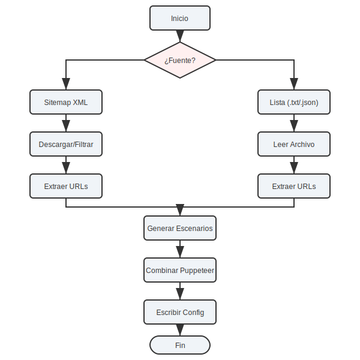

# Guía de Uso

Esta guía detalla cómo utilizar las herramientas de generación y ejecución de pruebas visuales.

## Flujo de Trabajo



El proceso comienza decidiendo la fuente de tus URLs: ¿Quieres probar todo el sitio (Sitemap) o una lista específica (Lista)?

---

## 1. Generación de Escenarios

El primer paso es siempre generar el archivo de configuración `backstop.json`. Tienes dos modos para hacer esto:

### Modo 1: Generación desde Sitemap (Recomendado para cobertura total)

Este modo es ideal para sitios dinámicos donde las URLs cambian frecuentemente. El script descargará el sitemap, procesará todas las URLs y generará un escenario para cada una.

**Comando:**
```bash
npm run generate-sitemap
```

**Comportamiento:**
1.  Lee `SITEMAP_URL` del archivo `.env`.
2.  Descarga y parsea el XML (soporta sitemaps anidados).
3.  Aplica filtros de exclusión (si están configurados).
4.  Genera `backstop.json` con todas las URLs encontradas.

### Modo 2: Generación desde Lista (Recomendado para pruebas específicas)

Este modo es perfecto para "Smoke Tests", probar nuevas funcionalidades específicas, o páginas que aún no están en el sitemap.

**Comando:**
```bash
# Usa la lista por defecto (url-lists/urls.txt)
npm run generate-list

# O especifica una lista personalizada
URL_LIST=url-lists/mis-urls.txt npm run generate-list
```

**Comportamiento:**
1.  Lee el archivo especificado en `URL_LIST`.
2.  Limpia las líneas (ignora comentarios `#` y líneas vacías).
3.  Genera `backstop.json` solo para esas URLs.

---

## 2. Crear Referencias (Base Line)

Una vez que tienes tu `backstop.json` generado, necesitas crear las imágenes de referencia. Estas imágenes representan el estado "correcto" de tu sitio.

```bash
npm run reference
```

Si prefieres ver una barra de progreso (útil para muchas URLs):

```bash
npm run reference:progress
```

## 3. Ejecutar Pruebas (Test)

Con las referencias creadas, puedes ejecutar las pruebas en cualquier momento para comparar el estado actual del sitio contra las referencias.

```bash
npm run test
```

O con barra de progreso:

```bash
npm run test:progress
```

Esto generará un reporte HTML que se abrirá automáticamente en tu navegador, mostrando las diferencias visuales encontradas.

## 4. Aprobar Cambios

Si los cambios detectados en el reporte son intencionales (por ejemplo, actualizaste el diseño del sitio), debes aprobarlos para que se conviertan en las nuevas referencias.

```bash
npm run approve
```

Esto sobrescribirá las imágenes de referencia antiguas con las nuevas capturas de la última prueba.

---

## Comandos Adicionales

### Limpiar Referencias

Si quieres empezar desde cero y borrar todas las imágenes generadas (referencias y resultados de pruebas):

```bash
npm run reset
```

### Ayuda

Para ver una lista rápida de comandos disponibles:

```bash
npm run help
```
