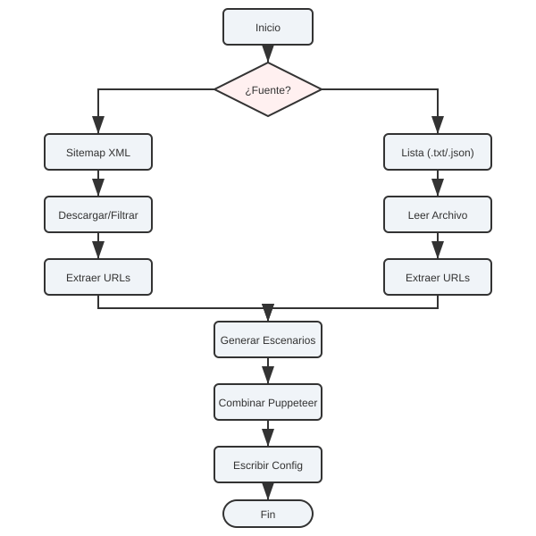

# Guía de Uso

Esta guía detalla cómo utilizar las herramientas de generación y ejecución de pruebas visuales.

## Flujo de Trabajo



El proceso comienza decidiendo la fuente de tus URLs: ¿Quieres probar todo el sitio (Sitemap) o una lista específica (Lista)?

---

## 1. Generación de Escenarios

El primer paso es siempre generar el archivo de configuración `backstop.json`. Tienes dos modos para hacer esto:

### Modo 1: Generación desde Sitemap (Recomendado para cobertura total)

Este modo es ideal para sitios dinámicos donde las URLs cambian frecuentemente. El script descargará el sitemap, procesará todas las URLs y generará un escenario para cada una.

**Comando:**
```bash
npm run generate-sitemap
```

**Comportamiento:**
1.  Lee `SITEMAP_URL` del archivo `.env`.
2.  Descarga y parsea el XML (soporta sitemaps anidados).
3.  Aplica filtros de exclusión (si están configurados).
4.  Genera `backstop.json` con todas las URLs encontradas.

### Modo 2: Generación desde Lista (Recomendado para pruebas específicas)

Este modo es perfecto para "Smoke Tests", probar nuevas funcionalidades específicas, o páginas que aún no están en el sitemap.

**Comando:**
```bash
# Usa la lista por defecto (url-lists/urls.txt)
npm run generate-list

# O especifica una lista personalizada
URL_LIST=url-lists/mis-urls.txt npm run generate-list
```

**Comportamiento:**
1.  Lee el archivo especificado en `URL_LIST`.
2.  Limpia las líneas (ignora comentarios `#` y líneas vacías).
3.  Genera `backstop.json` solo para esas URLs.

### Modo 3: Comparación Diseño vs. Live URL

Este modo compara una imagen de diseño estática (exportada de Figma o enviada por el diseñador UX/UI) contra una URL viva para medir fidelidad pixel a pixel.

**Variables de entorno requeridas:**
```bash
DESIGN_IMAGE=./designs/homepage.png   # Ruta a la imagen PNG o JPG
DESIGN_URL=https://misite.com         # URL a comparar (o usa SITE_URL)
```

**Variables opcionales:**
```bash
DESIGN_LABEL=Homepage                 # Nombre del escenario en el reporte
DESIGN_THRESHOLD=0.1                  # Tolerancia de diferencia en % (default: 0.1)
DESIGN_HIDE=.cookie-banner,.chat      # Selectores a OCULTAR (visibility:hidden, reserva su espacio)
DESIGN_REMOVE=header,.cookie-banner   # Selectores a QUITAR (display:none, el contenido de abajo sube)
DESIGN_VIEWPORT_HEIGHT=900            # Alto del viewport (default: 900px)
```

> **Nota:** El ancho del viewport se extrae automáticamente del ancho de la imagen. Si tu diseño es de 1440px, la captura del live será a 1440px. Si es de 390px (mobile), captura a 390px.

**Workflow:**

**Paso 1:** Genera la configuración
```bash
npm run design-generate
```

**Paso 2:** Ejecuta la comparación completa
```bash
npm run design-compare
```

Este segundo comando captura el diseño como referencia y luego compara el live site contra él en una sola operación.

**Interpretando el reporte HTML:**
- Panel izquierdo = imagen de diseño (referencia)
- Panel derecho = captura del sitio live
- Overlay = diferencias en rojo

**Ejemplo con dominio local:**
```bash
DESIGN_IMAGE=./designs/home.png DESIGN_URL=http://miproyecto.test npm run design-generate
npm run design-compare
```

Los dominios `localhost`, `.test`, `.local` y rangos privados (`192.168.x`, `10.x`) se detectan automáticamente y se omite la verificación SSL del navegador.

**Limpiar referencias de diseño:**
```bash
npm run reset
```

Elimina `backstop_data/design_reference/` junto con el resto de archivos generados.

---

## 2. Crear Referencias (Base Line)

Una vez que tienes tu `backstop.json` generado, necesitas crear las imágenes de referencia. Estas imágenes representan el estado "correcto" de tu sitio.

```bash
npm run reference
```

Si prefieres ver una barra de progreso (útil para muchas URLs):

```bash
npm run reference:progress
```

## 3. Ejecutar Pruebas (Test)

Con las referencias creadas, puedes ejecutar las pruebas en cualquier momento para comparar el estado actual del sitio contra las referencias.

```bash
npm run test
```

O con barra de progreso:

```bash
npm run test:progress
```

Esto generará un reporte HTML que se abrirá automáticamente en tu navegador, mostrando las diferencias visuales encontradas.

## 4. Aprobar Cambios

Si los cambios detectados en el reporte son intencionales (por ejemplo, actualizaste el diseño del sitio), debes aprobarlos para que se conviertan en las nuevas referencias.

```bash
npm run approve
```

Esto sobrescribirá las imágenes de referencia antiguas con las nuevas capturas de la última prueba.

---

## Comandos Adicionales

### Limpiar Referencias

Si quieres empezar desde cero y borrar todas las imágenes generadas (referencias y resultados de pruebas):

```bash
npm run reset
```

### Ayuda

Para ver una lista rápida de comandos disponibles:

```bash
npm run help
```
